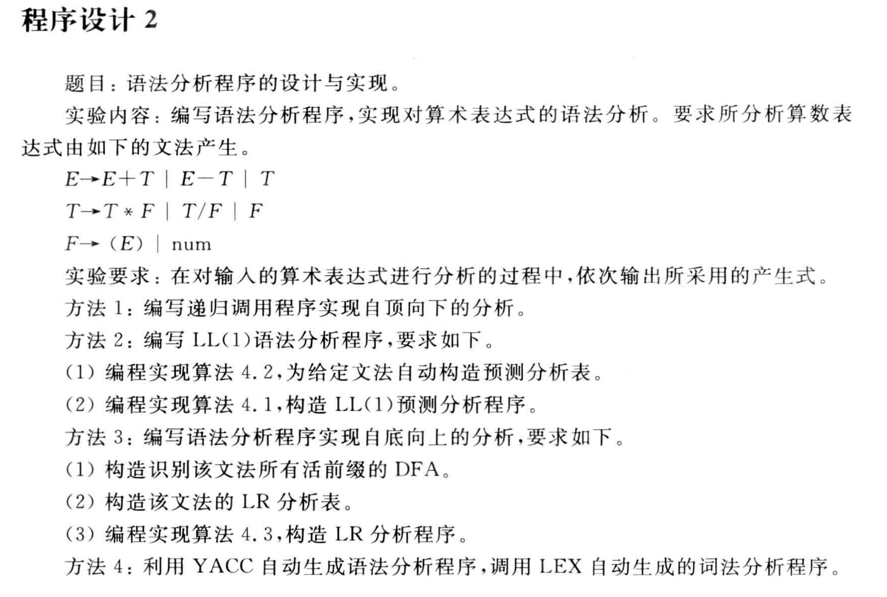

文法已转换为：
```
E → TE'
E'→ +TE' | -TE' | ε
T → FT'
T'→ *FT' | /FT' | ε
F → (E) | num
```
或者可以认为是：
```
E → TA
A → +TA | -TA | ε
T → FB
B → *FB | /FB | ε
F → (E) | num
```
对应的FIRST集和FOLLOW集：
```
FIRST(E) = { (, num }
FIRST(A) = { +, -, ε }
FIRST(T) = { (, num }
FIRST(B) = { *, /, ε }
FIRST(F) = { (, num }
```
# 方法1：
算法参照：
```
为文法中的每一个非终结符号A设计一个递归过程，用A（）表示；
Void A(){
	选择一个A产生式，A→X1X2……Xk;
	for(i=1 to k){
	if(Xi是一个非终结符）
		调用Xi();
	else if(Xi等于当前的输入符号a）
		匹配成功，读入下一个输入符号;
	else
		error();//无法继续匹配,需回溯；
	}
}
/*说明：如果开始符号对应的递归程序S()扫描整个输入串后正好停止执行，则说明分析成功。*/
```
# 方法2：
产生式的数据结构：

元组（产生式左部，）